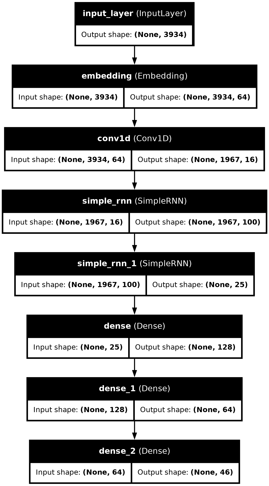
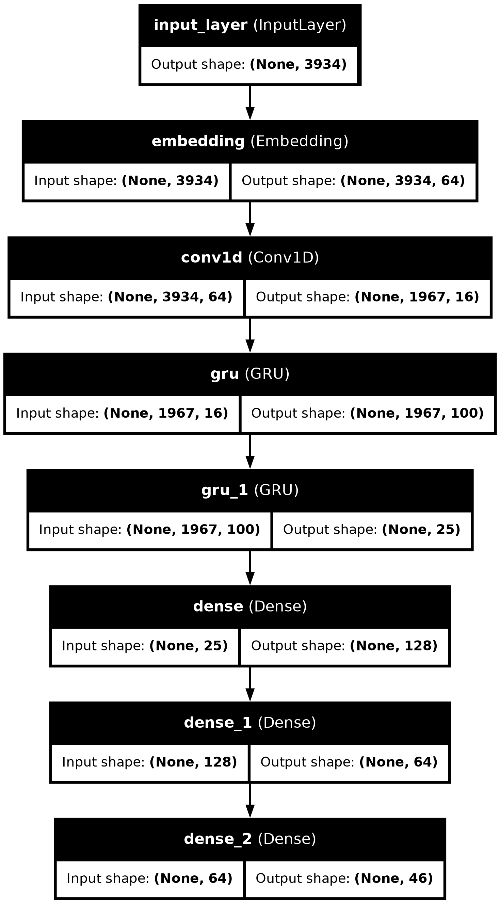
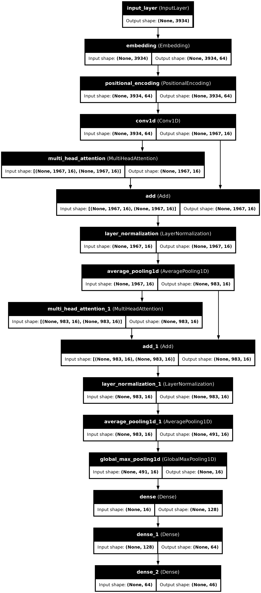
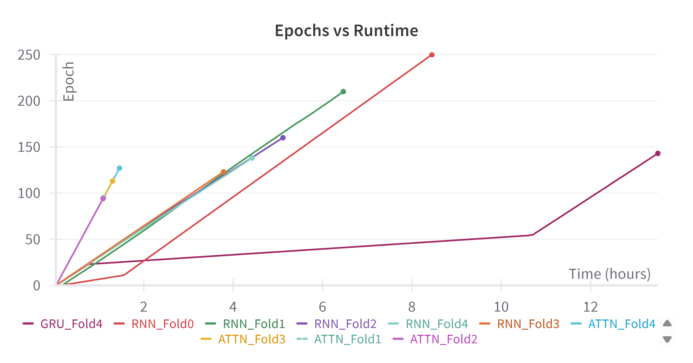

---
author:
- Paul Odhiambo Gariy
title: String Classification
---

# Introduction

Proteins are chains of amino acids that perform many different
biological functions, depending on the specific sequence of amino acids.
Families of amino acid chains exhibit similarities in their structure
and function. For a new chain, one problem we would like to solve is
predicting the family it most likely belongs to. In this assignment, we
will classify amino acid chains as one of 46 families. To do this, we
are using 3 different network types: Simple Repeating Neural Networks,
Gated Recurrent Unit Recurrent Neural Networks, and Multi-Headed
Attention Neural Networks.

# Data Extraction

Data extraction is done using a preprovided (Fagg) PFAM Loader code which takes
the required rotation of data and gives the input and output data set
for the training, validation and, test data sets.

# Network Architectures

The models have the same underlying architecture.

- The Input Layer.

- The Embedding Layer.

- For the Multi-Headed Attention (MHA) Model, there is a Positional
  Encoding layer added after the Embedding Layer. This augments the
  tokens with positional data. For this all models had repeating layers
  set with the following unit numbers: \[100,25\].

- Pre-processing Conv1D layer with striding to reduce the temporal
  length of the strings.

- One or more modules composed of:

  - SimpleRNN layer or GRU layer (Return sequences is True with the last
    having the return sequences as false) or MHA Layers.

  - 1D average pooling.

- The MHA model has an additional Global Maxpooling Layer.

- There is one or more Dense Layers with the output layer having a
  softmax activation. The non-output Dense Layers were 2, with unit
  numbers set as \[128,64\] for all models with activation as the
  Exponential Linear Unit.

## Training/Experiment Configuration

The training is configured with:

- **Rotations:** \[0-4\] different models trained (independently on
  different rotations)

- **Epochs:** 300

- **Learning Rate:** $1*10^{-3}$

- **Batch Size:** 64

- **Steps per Epoch:** 100

- **Early stopping:** Patience: $50$ and Monitoring: Validation Loss

{height="50%"}

{height="50%"}

{height="50%"}

# Plots, Results and Analysis

## Validation and Training Set Sparse Categorical Accuracy

{width="80%"}

{width="80%"}

## GRU vs MHA Model Sparse Categorical Accuracy comparison

{width="80%"}

## Test Accuracy across the different Models

{width="80%"}

## Contingency Table Across all Rotations (Best Performing Model - GRU)

{width="80%"}

# Reflection

## Architectural Choices

Aside from the base architecture, some choices were made to create the
networks. Many of the choices such as the number of units and layers in
the repeating layers and the dense layers were made to have a good
balance between the ability to learn complex functions (without an
increase in diminishing returns and overfitting) and keeping the
training as computationally low in cost as possible considering the
limited compute resources available for this assignment.

- **Embedding Dimension (64)**: This dimension was chosen as a balance
  between providing a rich representation of each token and maintaining
  computational efficiency.

- **Convolution Filters (16):** The number 16 was chosen as a starting
  point to extract a reasonable number of initial features without being
  overly computationally expensive.

- **Earlystop Patience (50):** From initial runs, I was getting a high
  performance at very early stages, and to be less computationally
  expensive, I set the patience low to ensure that the run stops as soon
  as a high accuracy level was already hit.

- **MHA Number of Heads (8):** I chose the number of heads to be 8 to
  ensure that the model has enough capacity to learn complex functions,
  but also stay low on the computational cost of training.

- **Number of repeating and dense layers (2):** This was kept low to
  prevent overfitting from having too complex a model and making the
  computation needed as low as possible.

- **Steps per Epoch (100):** This was a decision purely made to ensure
  that training takes the shortest time possible while ensuring there
  are enough passes on the data for efficient and effective learning
  during training.

## Model Performance and Consistencies

The models' performance across rotations has little variance if we look
at performance based on the Test Set Sparse Categorical Accuracy. The
final Test Set Sparse Categorical Accuracy values across rotations and
models are the following:\
\

  -------------- ------------- -------------- ---------------
   **Rotation**   Simple RNN        GRU             MHA
      **0**       0.98471475     0.9942776      0.99768561
      **1**       0.99293643     0.99623954     0.99847549
      **2**       0.99275655     0.99453568     0.99867839
      **3**       0.74119174     0.99379736     0.99885607
      **4**       0.96579874     0.99710113     0.99883032
     **Mean**     0.93547964     0.99519026     0.99850518
   **STD Dev**    0.097645337   0.0012612697   0.00043160584
  -------------- ------------- -------------- ---------------

\
\
From our results, the Simple RNN network has the lowest performance
values with a mean of 0.93 on the sparse categorical accuracy. This low
mean is especially contributed to by the low performance that the
network experiences in rotation 3. However, conducting a p-value test on
all the results of the networks on all rotations gives a **p-value of
0.245**. This shows a statistical insignificance in the differences in
performance between the models. The extremely low performance on
rotation 3 for the Simple RNN might have been combated using a less
punitive early stop regularization. This is because from the loss vs.
epoch curve for this training rotation, there is a sudden spike in loss
which slowly reduces back to a low loss level relative to what it was
before the spike, however, with the low patience levels I set for my
architecture the model did not have enough epochs to counter this sudden
spike in loss. I believe that running this rotation for longer would
have yielded higher accuracy results. Aside from the $\approx 0.74$
accuracy value, all models perform consistently throughout with low
variance and high accuracy values on the test data.

## Relative Model Performance

From the results, all the models perform with high levels of accuracy,
and there is no statistical significance in their different
performances, showing that with this architectural setup, all the
networks can perform at the same level in the classification of amino
acid chains.

## Training epochs and the amount of time required to complete each epoch per Model

The number of training epochs before early-stopping varied across the
different models. The Multi-Head Attention (MHA) model consistently had
the fewest number of epochs, with its longest training run stopping at
127 epochs with a runtime of 87 minutes, which was also the model's
longest recorded runtime. The GRU model took longer, with its longest
run reaching 157 epochs before early stop. The Simple RNN model had the
longest number of epochs, with its longest extending to 250 epochs.
Comparing total runtime, MHA had a max of 87 minutes, as mentioned, the
GRU model had its shortest at 127 minutes, but had a significantly long
runtime on rotation four of 13 hours over 143 epochs (not its max epoch
number). This run time was the longest across all models and rotations.
The Simple RNN had its shortest runtime at 127 minutes and its longest
at 8 hours on the model's 250-epoch maximum. The MHA model seems to have
convergence in terms of validation performance much faster than the GRU
and Simple RNN. This suggests that for this kind of classification, the
MHA architecture learns the underlying patterns more efficiently and
requires fewer passes through the data. The Simple RNN has more
sequential processing and is more susceptible to exploding or vanishing
gradients, and needs more epochs to have information propagated through
the network. GRU seems to fall in between taking benefits from its
gating mechanism, but still requires more sequential processing than
MHA. For most of the rotations, higher runtimes can be directly linked
to higher epoch counts with a little noise and computational differences
in terms of hardware utilization and capabilities affecting the overall
performance during training.

Looking at the figure, we get a better picture of epoch vs runtime.
We see however in rotation 4 of the GRU network, there is a
significantly lower gradient with epochs taking longer on average than
all the other runs. The data in Rotation 4 might have presented longer
or more complex sequences, leading to a significant increase in the
computational time required for each forward and backward pass through
the GRU network. Another explanation might also be a significant
degradation of the performance of the compute node the rotation was
running on, this is because all the rotations run on different nodes on
the partition and the system performance analysis shows a higher
utilization of the hardware resources on this rotation compared to the
rest.

### References

1.  Fagg, Andrew. *CS 5043: HW6: String classification.*
2.  Saul, Dobilas. *GRU Recurrent Neural Networks – A Smart Way to Predict Sequences in Python.*
3.  Fagg, Andrew. *Temporal Architectures.*
4.  Mistry, J., Chuguransky, S., Williams, L., Qureshi, M., Salazar, G.A., Sonnhammer, E.L.L., Tosatto, S.C.E., Paladin, L., Raj, S., Richardson, L.J., Finn, R.D., and Bateman, A. *Pfam: The protein families database in 2021*, 2021.
